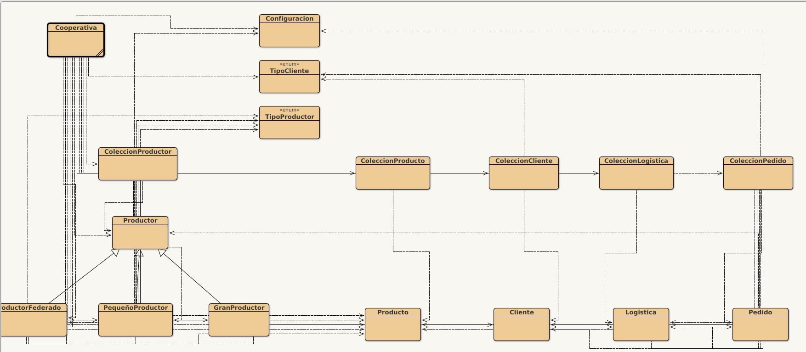

# PRACTICA PROGRAMACION ORIENTADA A OBJETOS 2023 PABLO RAMOS MURAS

Esta práctica ha sido realizada pro Pablo Ramos Muras para la asignatura de Programación Orientada a Objetos del curso 2022/2023.
Ha sido realizada usando el lenguaje de programación Java y el entorno de desarrollo [BlueJ](https://www.bluej.org/)

El proyecto puede ser cargado usando la carpeta source como proyecto en BlueJ.

## ESTRUCTURA DEL PROYECTO

La practica se estructura en el siguiente diagrama de clases.

Una explicación más detallada de la estructura del proyecto se puede encontrar en la 
[MEMORIA DE LA PRACTICA](https://github.com/murapa96/PracticaPOO/blob/98c816776822fee8c449b594ee60f29e7e336945/MemoriaPractica.pdf)

## RELEASE

En caso de problemas al cargar el proyecto en BlueJ, se puede descargar el archivo .jar que contiene el proyecto.

[practica.jar](https://github.com/murapa96/PracticaPOO/releases/tag/release)

